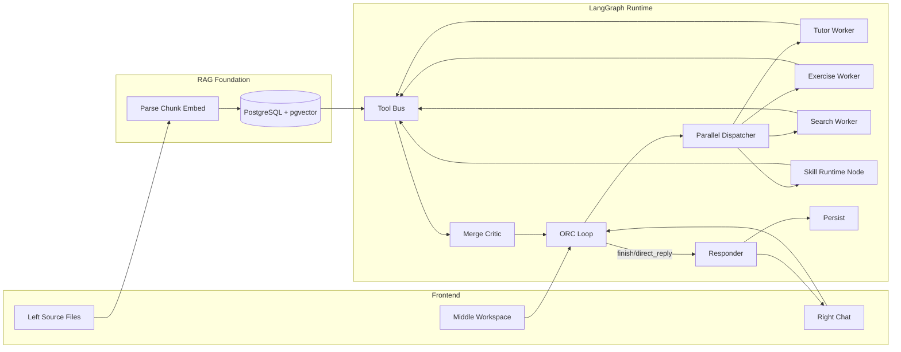
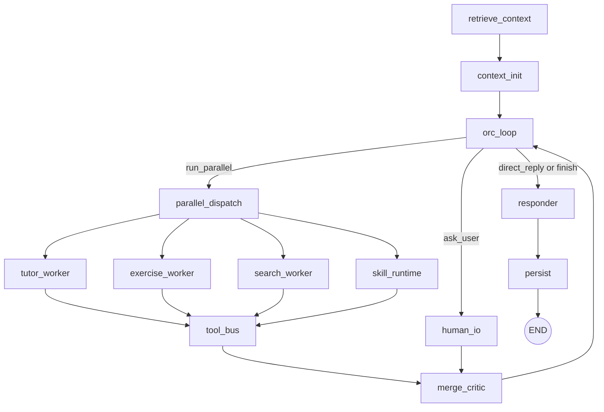

# Agentic Learning Coach One-Shot Design

Date: 2026-02-25
Owner: Backend/Agent Team
Status: Ready for implementation

Governing standard: [agentic-runtime-acceptance.md](d:/Exam-paper/docs/architecture/agentic-runtime-acceptance.md)

## 1. Objective
Build a production-grade learning coach agent in one delivery, replacing the current workflow-first graph with an ORC-driven agentic runtime that supports:
- ORC autonomous next-action decisions (no fixed per-turn sequence)
- Parallel multi-agent collaboration in a single request (for example Tutor + Exercise)
- Real skill runtime (Anthropic-style concept), not prompt JSON injection
- Left upload pane as RAG foundation using `text-embedding-v4` + PostgreSQL + pgvector
- Personalization via structured learner model
- Unified response gate, auditing, ACL, and deterministic persistence

This document is intentionally non-incremental: engineers should implement the full target design directly.

## 2. Scope (Single-shot target)
### Included
- New LangGraph topology centered on ORC action loop
- New state contract for world context, task board, and parallel execution
- Skill runtime subsystem with registry, versioning, ACL, and execution traces
- RAG ingestion/retrieval pipeline backed by pgvector
- Parallel dispatcher and merge/critic node
- Learner model persistence and online updates
- Unified responder output contract with provenance
- Router and streaming API compatibility for existing frontend

### Excluded
- Legacy prompt-only skill JSON behavior (must be removed)
- Fixed if/else routing flow as primary control

## 3. Design Principles
1. ORC decides, system constrains.
System enforces budgets/ACL/audit; ORC chooses next action.
2. No forced sequence.
No "every turn must diagnose then retrieve then ..." logic.
3. Evidence before answer.
Any knowledge claim should link to provenance (`chat|workspace|kb`).
4. Parallel when useful, serial when sufficient.
ORC may launch concurrent workers in one request.
5. Skill is executable runtime capability.
Skill is package + runtime contract, not prompt text snippet.

## 4. Unified Terminology
- `workspace_doc`: middle pane editable working artifact.
- `source_files`: left pane original uploaded files, read-only.
- `kb_chunks`: vectorized chunks derived from source files.
- `conversation_history`: right pane chat messages (already available; no extra ingestion needed).
- `ORC`: planner/controller brain.
- `Worker`: tutor/exercise/search specialized agent.
- `Skill`: executable capability package resolved by runtime.

## 5. Target System Architecture


## 6. LangGraph Topology (Required)


### Graph invariants
- ORC loop is the only node allowed to decide next action.
- All write actions go through Tool Bus ACL.
- Final user-visible message only emitted by `responder`.

## 7. ORC Action Protocol
ORC output must be strict JSON:
```json
{
  "next_action": "direct_reply|ask_user|run_parallel|finish",
  "goal_id": "string",
  "tasks": [
    {
      "task_id": "string",
      "executor": "tutor|exercise|search|skill",
      "objective": "string",
      "inputs": {},
      "budget": {"max_ms": 4000, "max_tokens": 2000, "max_tools": 4}
    }
  ],
  "expected_observation": "string",
  "stop_reason": null
}
```

Rules:
- `tasks` is empty for `direct_reply|finish|ask_user`.
- `run_parallel` requires at least one task; can include multiple executors.
- ORC cannot invoke tools directly; it delegates to worker/skill tasks.

## 8. Parallel Collaboration Contract
Each child task returns:
```json
{
  "task_id": "string",
  "status": "ok|error|needs_input",
  "result_type": "explanation|exercise_set|retrieval|skill_output",
  "content": {},
  "provenance": [
    {"source_type": "chat|workspace|kb", "source_id": "string", "span": "optional"}
  ],
  "metrics": {"latency_ms": 0, "token_used": 0, "tool_calls": 0}
}
```

`merge_critic` responsibilities:
- Consistency check (difficulty, terminology, objective alignment)
- Conflict resolution (duplicate questions, contradictory guidance)
- Consolidated observation for ORC re-decision

## 9. Skill Runtime (Real Runtime Capability)
### Skill package structure
Each skill lives as package metadata + resources, not plain prompt text.
Required fields:
- `skill_id`, `version`, `scope(system|tenant|user)`, `enabled`
- `entrypoint_type(instruction|script|hybrid)`
- `allowed_tools[]`
- `input_schema`, `output_schema`
- `timeout_ms`, `retry_policy`

### Execution
- ORC creates skill task -> `skill_runtime` resolves package -> validates input schema -> executes entrypoint -> returns structured output -> Tool Bus applies ACL.
- Any skill attempting disallowed tool call fails hard with audit record.

### Storage
Add tables:
- `agent_skills`
- `agent_skill_versions`
- `agent_skill_bindings` (tenant/user enablement)
- `agent_skill_runs` (trace)

## 10. RAG Foundation Design (`text-embedding-v4`)
### Ingestion
- Input: `source_files`
- Parse to normalized text blocks with page anchors
- Chunking defaults: 700-900 tokens, overlap 120 tokens
- Embedding model fixed: `text-embedding-v4`
- Persist vectors in pgvector

### Retrieval tool
`kb_search(query, filters, top_k)`
- filters: `tenant_id`, `user_id`, `document_id`, optional tags
- returns chunk text + score + citation metadata

### Required tables
- `kb_documents`
- `kb_chunks`
- `kb_chunk_embeddings` (vector column)
- `kb_ingest_jobs`

Required index
- ivfflat/hnsw on embedding vector (pgvector)
- btree on `(tenant_id, user_id, document_id)`

## 11. Learner Model (Personalization)
Persist structured learner state:
```json
{
  "mastery_by_concept": {"function_monotonicity": 0.62},
  "error_patterns": ["sign_error", "domain_miss"],
  "teaching_preference": {"style": "step_by_step", "verbosity": "medium"},
  "pace_preference": {"batch_size": 3, "difficulty": "medium"},
  "confidence_signal": 0.48,
  "intervention_effectiveness": {"socratic": 0.71, "direct_demo": 0.55}
}
```

Add table:
- `learner_profiles` (jsonb profile + updated_at)

Update policy:
- `persist` updates learner profile using latest turn outcomes and tool results.

## 12. State Contract (LangGraph)
Replace/extend `AgentState` with required keys:
- identity/context:
  - `tenant_id`, `user_id`, `session_id`, `thread_id`
  - `conversation_history`
  - `workspace_doc_id`, `workspace_snapshot`
  - `source_file_ids`
- memory:
  - `history_summary`, `hydrated_facts`
  - `learner_profile`
- orc runtime:
  - `goal_id`, `task_board`, `active_tasks`, `task_results`
  - `loop_budget` (`max_steps`, `remaining_ms`, `remaining_tokens`)
  - `last_observation`, `stop_reason`
- tool/skill:
  - `pending_tool_calls`, `tool_results`
  - `skill_selection`, `skill_run_traces`
- output:
  - `assistant_reply`, `response_provenance`

## 13. Tool Bus ACL and Write Safety
All tools registered with capability metadata:
- `mode`: read|write
- `resource_scope`
- `risk_level`

Enforcement:
1. Validate executor permission (worker/skill)
2. Validate tenant/user ownership
3. Validate request against schema
4. Execute
5. Append immutable audit record

Write tools (`question.insert/replace` etc.) are commit-gated:
- default execute in dry-run during parallel phase
- commit only after ORC confirms final plan

## 14. API Contract Changes
Maintain existing `/api/agent/run` and `/run-stream` endpoints.
Backend changes:
- request parser maps middle pane to `workspace_doc_id/workspace_snapshot`
- source file IDs included for RAG scope
- stream events add:
  - `agent_trace` for ORC action and task dispatch
  - `task_result` for each parallel task completion
  - `provenance` for final response citations

## 15. File-level Implementation Map (current repo)
Required updates:
- `backend/app/assistant_graph/builder.py`
  - replace fixed router graph with ORC loop graph
- `backend/app/assistant_graph/state.py`
  - new state contract fields above
- `backend/app/assistant_graph/nodes/`
  - add: `orc_loop.py`, `parallel_dispatch.py`, `merge_critic.py`, `skill_runtime.py`, `responder.py`
  - refactor existing `tutor_agent.py`, `exercise_agent.py`, `search_agent.py` to task executors
  - keep `persist.py`, but update persistence payload and learner profile updates
- `backend/app/assistant_graph/tool_runtime.py`
  - evolve into ACL-backed Tool Bus runtime
- `backend/app/skills/`
  - replace prompt-only meta usage with executable registry + versioning access
- `backend/app/routers/agent_v2.py`
  - inject workspace/source IDs into state
  - emit extended streaming events
- database migrations under `backend/db/migrations/`
  - add skill runtime tables, kb tables, learner profile table

## 16. Reliability, Idempotency, and Failure Handling
- Any task timeout/error returns `status=error` and still flows to `merge_critic`.
- ORC decides retry/fallback/direct reply based on observation.
- Persist operation idempotency key:
  - `(tenant_id, session_id, thread_id, run_id)`
- Interrupted runs resumable via existing `Command(resume=...)`.

## 17. Performance Budgets (Hard limits)
- request wall time target: P95 <= 6.5s for simple asks, <= 11s for parallel tutor+exercise
- ORC loop max steps: 4
- max parallel tasks per turn: 3
- max tool calls per task: 4
- fail-fast to direct reply when remaining budget insufficient

## 18. Security and Compliance
- Strict tenant isolation on all kb/skill/tool queries
- Skill scripts run in restricted runtime; no arbitrary filesystem/network outside allowlist
- All write actions audit logged with actor, task_id, goal_id, diff summary

## 19. End-to-end Acceptance Criteria
Implementation is complete only if all pass:
1. ORC can direct-reply without invoking workers/tools.
2. ORC can dispatch Tutor+Exercise in parallel and merge into one coherent response.
3. Left uploaded file content is retrievable through RAG using `text-embedding-v4` embeddings.
4. Final response includes provenance entries for KB-grounded claims.
5. Skill runtime can execute user-scoped skill version with ACL enforcement.
6. Disallowed skill tool call is blocked and audited.
7. Learner profile updates after each completed turn.
8. Existing stream API remains compatible for frontend consumption.
9. Persisted history remains consistent after interrupt/resume.
10. No fixed per-turn rule sequence exists in control flow.

## 20. Test Matrix (must be implemented with code)
- unit: ORC action parser, task schema validation, ACL, merge critic conflict resolution
- integration: parallel dispatch + merge + responder
- integration: RAG ingest/retrieve with pgvector
- integration: skill runtime (success, timeout, ACL deny)
- e2e: solve-only, solve+exercise parallel, skill-driven study method, interrupt/resume

---
This is the single target architecture. Any implementation that preserves old prompt-only skill behavior or fixed workflow routing is out of scope for this design.
